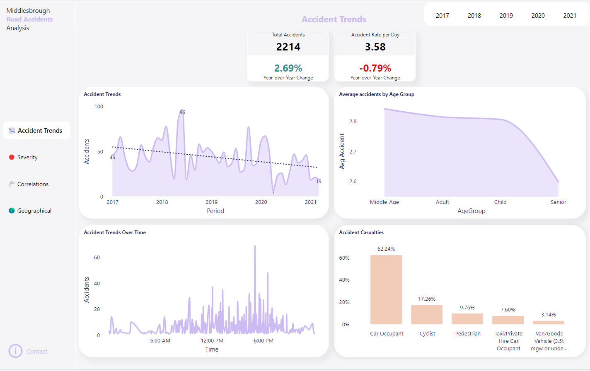
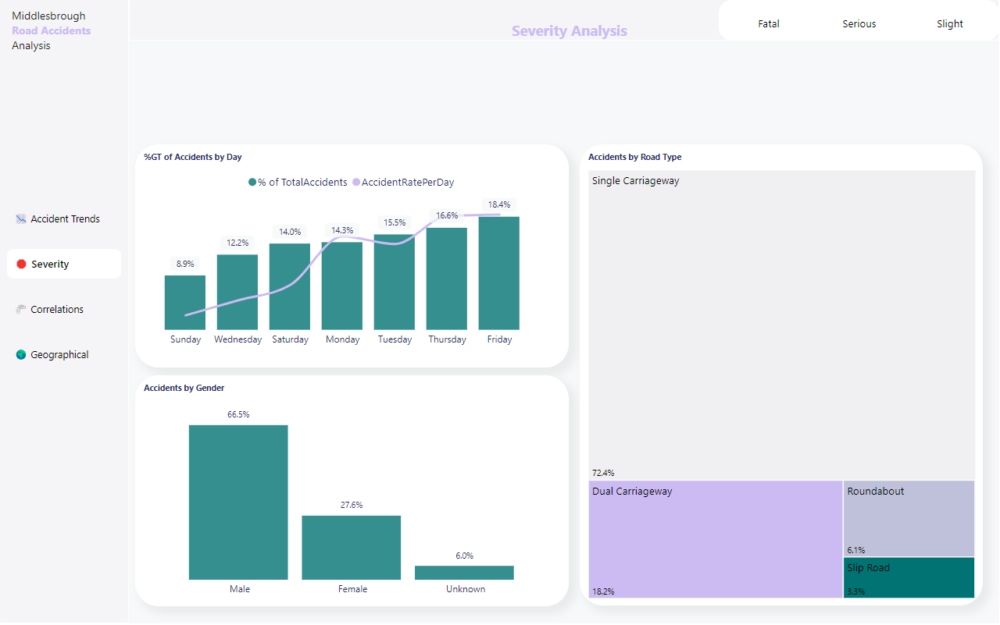
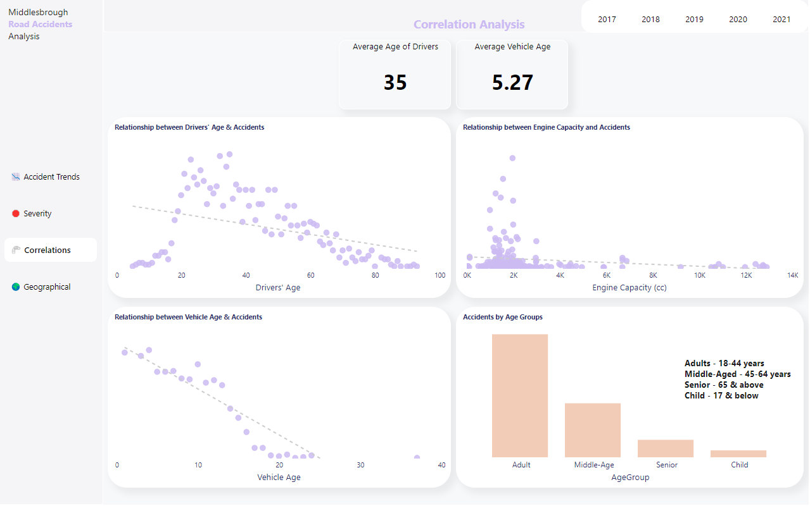

# Middlesbrough-Accident-Analysis

## Introduction
The global concern over road accidents, which result in significant loss of life and property, necessitates the analysis of accident trends to develop effective preventive measures. In the era of data-driven decision-making, leveraging Power BI can provide valuable insights into road accident data.

##
The objective of this project is to perform a descriptive analysis of road accidents in Middlesbrough to enhance road safety by identifying patterns and trends.

## Data Source
The road safety data for this project was sourced from the UK Gov website, specifically from the Department of Transport. Three CSV files were downloaded, including Road Safety Casualties Last 5 years, Road Safety Vehicles Last 5 years, and Road Safety Accidents Last 5 years. A data dictionary in .xlsx format was also downloaded to understand the data in the tables. [Website Link](https://www.data.gov.uk/dataset/cb7ae6f0-4be6-4935-9277-47e5ce24a11f/road-safety-data)
## Data Load
The three tables were uploaded into a database using SQL Server Management Studio (SSMS). This provided a foundation for the subsequent exploratory data analysis.

## Exploratory Data Analysis:
Initial exploratory data analysis was conducted in the SSMS environment to gain insights into the data. Further details of the analysis can be found via this [link](https://github.com/sa-diq/UK-Accident-Analysis/tree/main).
## Data Transformation:
The required data was saved as a VIEW in SSMS and then imported into Power BI. Power Query was used for data transformation. Various steps were taken to prepare the data for analysis, as shown in the attached images.

## Data Modeling
The star schema data model was applied to the dataset, with dimension tables such as area, road, severity, journey purpose, casualty, weather, and date. These tables were linked to the facts table through their primary keys, enabling efficient analysis and exploration of the data.

## Data Analysis and Dashboard:
The data analysis focused on accident trends, severity, correlations, and geographical analysis. Using DAX and calculated columns, these analyses provided insights into various aspects of Middlesbrough road accidents. A dedicated dashboard page was created for each segment, allowing users to navigate and personalize the displayed information according to their needs.
#### Notable Statistics:
* Total Accidents: 2214
* Accidents Rate per Day: 3.58
* Average Driver Age: 35 years
* Average Vehicle Age: 5.27 years

The pages of the dashboard are seen in the screenshot below:

## Summary of Findings
Several key findings emerged from the analysis:
- There is a downward trend in the number of accidents recorded from 2017 to 2021.
- The highest number of accidents occurred around 5 pm.
- Private car occupants accounted for 57% of all casualties, followed by cyclists (16%) and pedestrians (9%).
- Fridays had the highest number of accidents, with 33% of them being fatal accidents.
- Most fatal accidents occurred on single-carriageway roads (58%).
- 67% of the casualties were male.
- There is a negative correlation between drivers' age and the number of accidents.
- 90% of the accidents happened in fine weather conditions with no winds.
- The journey type of the driver was unknown in 73% of the accidents, while work-related journeys accounted for 16%.

## Recommendations
Based on the findings, several recommendations can be made to enhance road safety:
1. Implement targeted campaigns and regulations to promote private car safety, including seatbelt use and discouraging distracted driving.
2. Increase law enforcement and safety campaigns during peak hours to address potential contributing factors to accidents.
3. Collaborate with businesses to implement workplace safety programs that emphasize safe driving practices for work-related journeys.
4. Implement weather-responsive safety measures during adverse conditions to address the remaining 10% of accidents.
5. Focus on safety initiatives for single-carriageway roads, including improved signage, road conditions, and awareness campaigns.

## Conclusion
Analyzing road accident trends is crucial for improving road safety. By utilizing Power BI and SQL Server, organizations can gain valuable insights, identify patterns, and perform analysis to develop effective preventive measures. This data-driven approach is essential for policymakers and stakeholders in their efforts to enhance road safety.
The interactive dashboard can be assessed via this link [HERE](https://app.powerbi.com/view?r=eyJrIjoiZjQ5ZDczMWQtM2UwNi00YzYxLWJhODUtYzNhN2UwYmIyNGI2IiwidCI6IjVmZjhkZDRiLTBiZDMtNGRjYS1hNjc2LTgzNmQwN2I0MWNhMSIsImMiOjh9)

